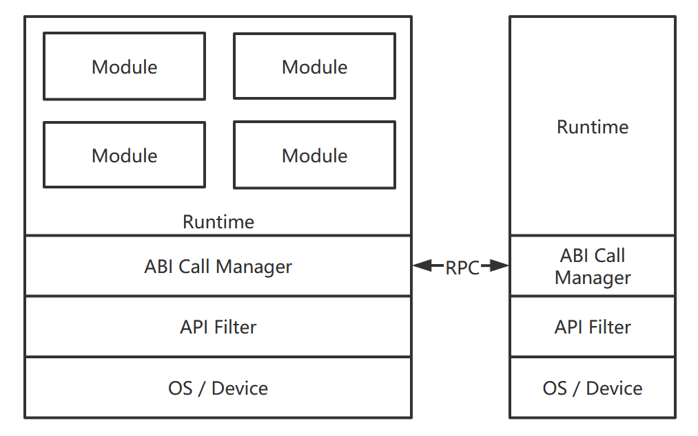

# Marrow

[简体中文](README.zh.md)

`Marrow` is a safety runtime for unversal device. Now `Marrow` use `Webassembly` as runtime.

## Usage

## Design

`Marrow` can load multiple `Webassembly` modules, these modules call each other through `CABI`. `Marrow` provides standard libraries in multiple languages, that can access resource for physical node.

In the future, `Marrow` will support running modules in distributed.

### ABI Call Manager

### ABI Filter

## Versions

### Single thread runtime for javascript

> Current version.

This version can apply for browser and server.

### Single thread runtime for rust

### Distributed runtime
